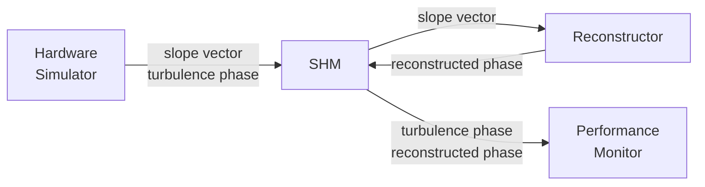

## Hardware simulator for SCAO reconstruction

For the first version, the `Reconstructor` will take open-loop slopes, as provided by the `Hardware Simulator`, and compute the reconstructed phase, which will be compared to the true phase by the `Performance Monitor`.


### Setup
Install the Python requirements with:
```bash
pip install -r requirements.txt
```
### Running
Launch these 3 processes in separate shell sessions.
```bash
### Shell session 1
python src/hardware_simulator.py
```
Wait for the above call to start displaying a timing output like: `rms wf: 0.6607 um: : 1814it [03:28, 10.52it/s]`.

Then, launch the reconstructor script:
```bash
### Shell session 2
python src/reconstructor.py
```
Again, wait for that to produce a timing output, then launch:
```bash
### Shell session 3
python src/performance_monitor.py
```
The reason for waiting is to give the programs time to write to shared memory before calling them from another program.

### Modifying
The `Hardware Simulator` and `Performance Monitor` are built, but the `Reconstructor` currently estimates all zeros. You can replace the function `compute_phase()` in the `reconstructor.py` file with a working reconstructor.